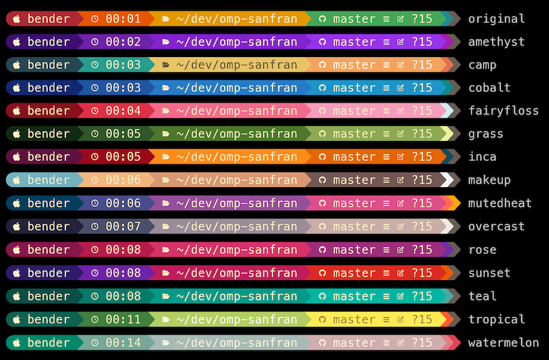

# omp-sanfran

A prompt theme for [oh-my-posh](https://ohmyposh.dev/).




## Install

1. Install [oh-my-posh](https://ohmyposh.dev/docs).

2. Copy to `~/.config/oh-my-posh.toml` (or your preferred config file location).

3. Tell oh-my-posh to use the config file (usually the last line in your shell's config):
   ```
   eval "$(oh-my-posh init zsh --config ~/.config/oh-my-posh.toml)"
   ```

