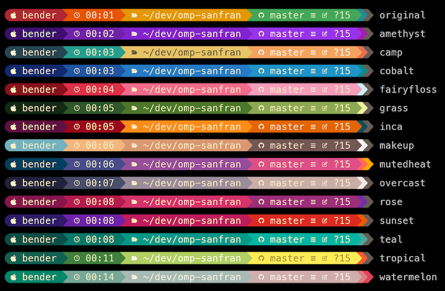

# omp-sanfran

Prompt themes for [oh-my-posh](https://ohmyposh.dev/).



## Prerequisites

- Install [oh-my-posh](https://ohmyposh.dev/docs).
- Install a [Nerdfont](https://www.nerdfonts.com/font-downloads) of your choice ([Meslo LG](https://github.com/ryanoasis/nerd-fonts/releases/download/v3.4.0/Meslo.zip) is pretty great!).

## Install

```
mkdir -p ~/.config/omp-sanfran
git clone https://github.com/mlilley/omp-sanfran.git ~/.config/omp-sanfran
```

Then update the oh-my-posh line in your `~/.zshrc` to specify the desired theme file:

```
eval "$(oh-my-posh init zsh --config ~/.config/omp-sanfran/omp-sanfran-original.toml)"
                                     ^^^^^^^^^^^^^^^^^^^^^^^^^^^^^^^^^^^^^^^^^^^^^^^
```
